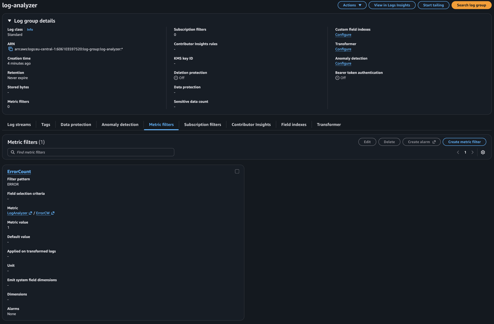
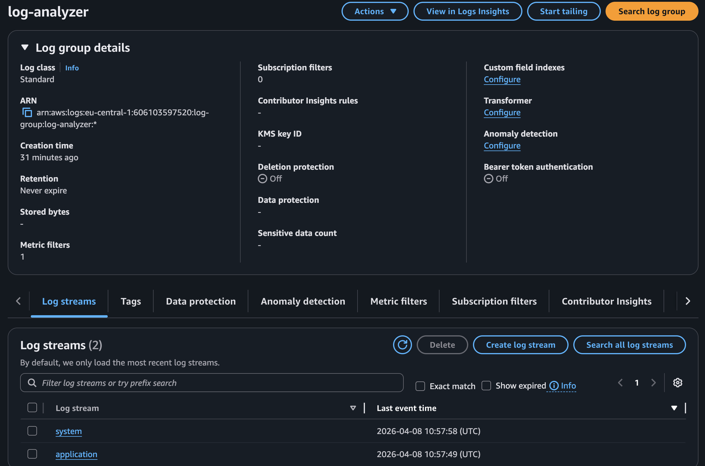
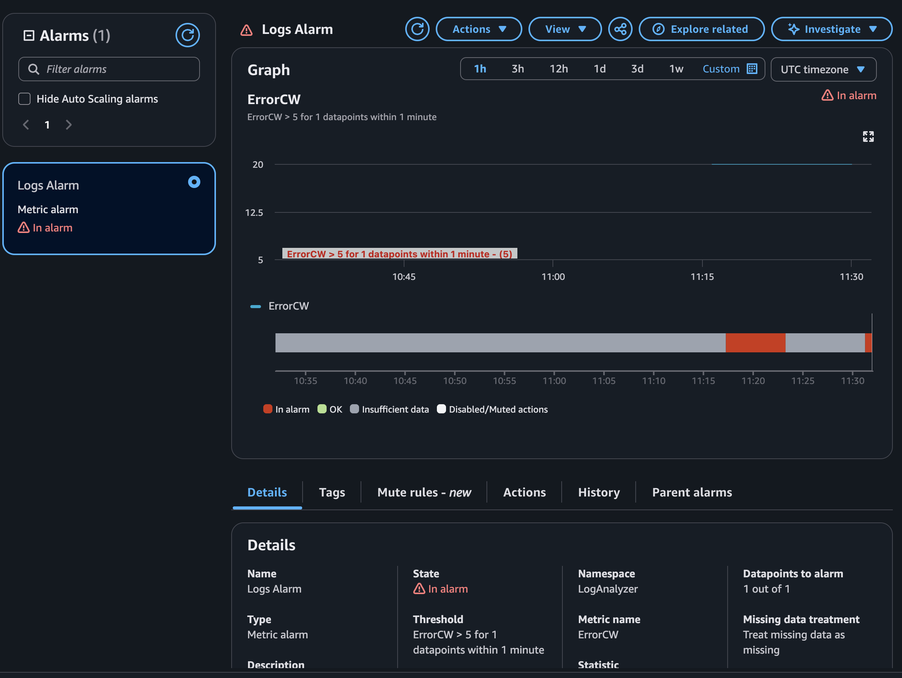
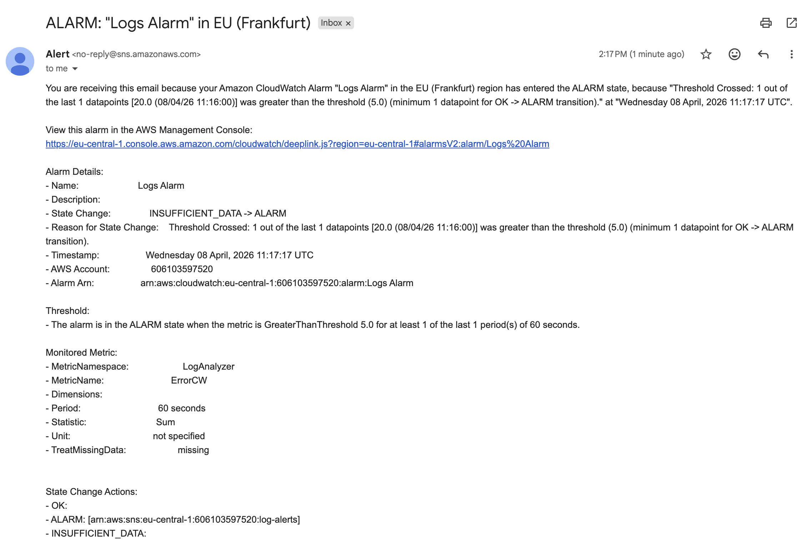

# Log Analyzer — Bash + EC2 + CloudWatch + SNS

A Bash script that scans log files for errors, saves a structured report, and alerts you when things go wrong. Started as a local automation tool, then extended into a full AWS monitoring pipeline with real-time email alerts.

---

## The Problem

If you've worked in a DevOps or cloud engineering role, you know the drill: multiple services dumping logs into a directory, and someone has to manually grep through them every morning looking for errors. It's repetitive, easy to miss things, and a genuine waste of time.

That was the starting point. What used to take 30–45 minutes of manual command execution per day — checking for `ERROR`, `FATAL`, and `CRITICAL` entries across multiple log files — now runs in seconds with a single command, and fires an email automatically when something actually needs attention.

---

## Architecture


The full flow once deployed on AWS:

```
Shell Script (Bash)
      ↓
EC2 Instance  ←  IAM Role (CloudWatchAgentServerPolicy)
      ↓
CloudWatch Agent
      ↓
CloudWatch Logs  (log group: log-analyzer)
      ↓
Metric Filter  (ERROR → ErrorCW metric)
      ↓
CloudWatch Alarm  (threshold: ErrorCW > 5)
      ↓
Amazon SNS  (topic: log-alerts)
      ↓
Email Notification
```

---

## What the Script Does

- Scans only log files modified in the **last 24 hours** — no point re-checking files that haven't changed
- Searches for configurable error patterns: `ERROR`, `FATAL`, `CRITICAL`
- Counts occurrences per pattern, per file
- Saves a full structured report to a `.txt` file
- Prints an `ALERT` to stdout if any pattern count exceeds your defined threshold
- Easy to adapt — everything configurable at the top of the file

---

## The Script

```bash
#!/bin/bash

# analyze-logs.sh
# Scans log files for errors and saves a report
# Sergiu Gota — github.com/sergiugotacloud

LOG_DIR="/home/ec2-user/logs"
REPORT_FILE="/home/ec2-user/logs/log_analysis_report.txt"
ERROR_PATTERNS=("ERROR" "FATAL" "CRITICAL")
THRESHOLD=10

# make sure the logs folder actually exists before we do anything
if [ ! -d "$LOG_DIR" ]; then
    echo "ERROR: Log directory not found: $LOG_DIR"
    exit 1
fi

# start fresh report each run
echo "Log Analysis Report" > "$REPORT_FILE"
echo "======================" >> "$REPORT_FILE"
echo "Run at: $(date)" >> "$REPORT_FILE"

echo -e "\nLog files modified in last 24h:" >> "$REPORT_FILE"
LOG_FILES=$(find "$LOG_DIR" -name "*.log" -mtime -1)

# nothing to do if no files were updated recently
if [ -z "$LOG_FILES" ]; then
    echo "No log files modified in the last 24h." >> "$REPORT_FILE"
    exit 0
fi

echo "$LOG_FILES" >> "$REPORT_FILE"

# loop through each log file and check for each error pattern
find "$LOG_DIR" -name "*.log" -mtime -1 -print0 | while IFS= read -r -d '' LOG_FILE; do

    echo -e "\n===================================" >> "$REPORT_FILE"
    echo "Processing: $LOG_FILE" >> "$REPORT_FILE"
    echo "===================================" >> "$REPORT_FILE"

    for PATTERN in "${ERROR_PATTERNS[@]}"; do

        echo -e "\nChecking: $PATTERN" >> "$REPORT_FILE"

        MATCHES=$(grep "$PATTERN" "$LOG_FILE" 2>/dev/null || true)
        COUNT=$(grep -c "$PATTERN" "$LOG_FILE" 2>/dev/null)

        echo "$MATCHES" >> "$REPORT_FILE"
        echo "Count: $COUNT" >> "$REPORT_FILE"

        # if count goes above threshold, flag it in the report
        # adjust THRESHOLD at the top depending on how noisy your logs are
        if [ "$COUNT" -gt "$THRESHOLD" ]; then
            echo "NOTICE: High number of $PATTERN in $LOG_FILE" >> "$REPORT_FILE"
        fi

    done

done

echo -e "\nLog analysis completed."
echo "Report saved at: $REPORT_FILE"
```

---

## Quick Start (Local)

### 1. Download the script

```bash
curl -O https://raw.githubusercontent.com/YOUR_GITHUB/log-analyzer/main/analyze-logs.sh
```

### 2. Edit the config block at the top

```bash
LOG_DIR="/path/to/your/logs"           # where your .log files live
REPORT_FILE="/path/to/report.txt"      # where to save the output
ERROR_PATTERNS=("ERROR" "FATAL" "CRITICAL")
THRESHOLD=10                           # alert if count exceeds this
```

### 3. Make it executable and run

```bash
chmod +x analyze-logs.sh
./analyze-logs.sh
```

### 4. Automate with cron (optional)

Run daily at 8am without thinking about it:

```bash
crontab -e
# Add:
0 8 * * * /home/ec2-user/analyze-logs.sh
```

---

## Deploying on AWS — EC2 + CloudWatch + SNS

### Step 1 — Launch an EC2 instance

Amazon Linux 2023, t3.micro, eu-central-1. Attach an IAM role with `CloudWatchAgentServerPolicy` — the CloudWatch Agent needs this to push logs.


### Step 2 — SSH into the instance

```bash
ssh -i YOURKEYPAIR.pem ec2-user@YOUR_EC2_IP
```


Once connected, create the logs directory and drop your sample log files in:

```bash
mkdir -p ~/logs
# Upload your log files via scp or create test ones:
echo "ERROR: payment failed" >> ~/logs/application.log
echo "FATAL: database down" >> ~/logs/application.log
echo "CRITICAL: disk full" >> ~/logs/system.log
```

### Step 3 — Upload and run the script

```bash
# From your local machine:
scp -i YOURKEYPAIR.pem analyze-logs.sh ec2-user@YOUR_EC2_IP:~/

# On the instance:
chmod +x ~/analyze-logs.sh
./analyze-logs.sh
```


The script creates a report at `~/logs/log_analysis_report.txt`. You can read it with:

```bash
cat ~/logs/log_analysis_report.txt
```


### Step 4 — Test the alert threshold

Inject 12 errors to trigger the alert logic (threshold is set to 10):

```bash
for i in {1..12}; do echo "ERROR: overload" >> ~/logs/system.log; done
./analyze-logs.sh
```

You'll see this in stdout:

```
ALERT: ERROR issue detected in /home/ec2-user/logs/system.log
```


### Step 5 — Install the CloudWatch Agent

```bash
sudo dnf install amazon-cloudwatch-agent -y
```

Create the config file at `/opt/aws/amazon-cloudwatch-agent/etc/amazon-cloudwatch-agent.json`:

```json
{
  "logs": {
    "logs_collected": {
      "files": {
        "collect_list": [
          {
            "file_path": "/home/ec2-user/logs/application.log",
            "log_group_name": "log-analyzer",
            "log_stream_name": "application"
          },
          {
            "file_path": "/home/ec2-user/logs/system.log",
            "log_group_name": "log-analyzer",
            "log_stream_name": "system"
          }
        ]
      }
    }
  }
}
```

Start the agent:

```bash
sudo /opt/aws/amazon-cloudwatch-agent/bin/amazon-cloudwatch-agent-ctl \
  -a fetch-config \
  -m ec2 \
  -s \
  -c file:/opt/aws/amazon-cloudwatch-agent/etc/amazon-cloudwatch-agent.json
```

Verify it's running:

```bash
sudo systemctl status amazon-cloudwatch-agent
```

### Step 6 — Verify logs are arriving in CloudWatch

Go to **CloudWatch → Log groups → log-analyzer**. You should see two log streams: `application` and `system`.





### Step 7 — Create a Metric Filter

In the AWS Console, go to **Log groups → log-analyzer → Metric filters → Create metric filter**:

- Filter pattern: `ERROR`
- Metric namespace: `LogAnalyzer`
- Metric name: `ErrorCW`
- Metric value: `1`

This turns every `ERROR` line in the logs into a countable CloudWatch metric.

### Step 8 — Create the Alarm

Go to **CloudWatch → Alarms → Create alarm**:

- Select metric: `LogAnalyzer → ErrorCW`
- Threshold: greater than `5` for `1 out of 1` datapoints, 1-minute period
- Action: send notification to an SNS topic

Create an SNS topic called `log-alerts` if you don't have one, and subscribe your email to it. You'll get a confirmation email — make sure to confirm the subscription or alerts won't deliver.



### Step 9 — Email alert fires

When the `ErrorCW` metric crosses the threshold, you get an email within about a minute:



The email includes the alarm name, timestamp, metric details, and a direct link to the alarm in the AWS Console.

---

## Screenshots Summary

| # | File | What it shows |
|---|------|---------------|
| 1 | `1. ec2-instance.png` | EC2 instance `log-analyzer` running in eu-central-1 |
| 2 | `2. ssh-connection.png` | SSH into Amazon Linux 2023 |
| 3 | `3. script-execution.png` | Running `./analyze-logs.sh` on the instance |
| 4 | `4. report-output.png` | Report output broken down by file and pattern |
| 5 | `5. alert-trigger.png` | ALERT stdout message when threshold is exceeded |
| 6 | `6-cloudwatch-log-group.png` | `log-analyzer` log group in CloudWatch |
| 7 | `7-log-streams.png` | `system` and `application` log streams with timestamps |
| 8 | `8-alarm-in-alarm.png` | CloudWatch alarm in ALARM state, `ErrorCW > 5` |
| 9 | `9-email-alert.png` | SNS email notification from Frankfurt region |
| 10 | `10-sns-subscription.png` | SNS subscription confirmation |
| 11 | `11. architecture-diagram.png` | Full architecture diagram |

---

## Customisation

The script is kept intentionally simple so it's easy to adapt. Common changes:

**Add more error patterns**
```bash
ERROR_PATTERNS=("ERROR" "FATAL" "CRITICAL" "EXCEPTION" "TIMEOUT")
```

**Change the time window** — look back 2 days instead of 1:
```bash
LOG_FILES=$(find "$LOG_DIR" -name "*.log" -mtime -2)
```

**Lower the threshold for sensitive services:**
```bash
THRESHOLD=3
```

**Send alert to Slack instead of just stdout:**
```bash
# Replace the echo "ALERT..." line with:
curl -s -X POST -H 'Content-type: application/json' \
  --data "{\"text\":\"ALERT: $PATTERN spike in $LOG_FILE\"}" \
  YOUR_SLACK_WEBHOOK_URL
```

**Send local email alert (if `mail` is configured):**
```bash
echo "ALERT: $PATTERN in $LOG_FILE" | mail -s "Log Alert" your@email.com
```

---

## Troubleshooting

**Script runs but no log files are processed**

Check if the find command is returning anything:
```bash
find /home/ec2-user/logs -name "*.log" -mtime -1
```
If empty, your log files are either older than 24h or in a different path. Either update `LOG_DIR` or touch the files to update their modification timestamp:
```bash
touch ~/logs/application.log
```

**CloudWatch Agent is installed but no logs appearing in console**

Check the agent status:
```bash
sudo systemctl status amazon-cloudwatch-agent
```

Check agent logs for errors:
```bash
sudo tail -f /opt/aws/amazon-cloudwatch-agent/logs/amazon-cloudwatch-agent.log
```

Common cause: the IAM role isn't attached to the instance, or it doesn't have `CloudWatchAgentServerPolicy`. Verify under EC2 → Instance → Security → IAM role.

**Alarm stays in INSUFFICIENT_DATA state**

This means no data points have been received yet. The metric filter only creates a data point when a matching log line arrives. Inject a few errors and run the script again:
```bash
for i in {1..6}; do echo "ERROR: test" >> ~/logs/system.log; done
./analyze-logs.sh
```
Wait 60–90 seconds for the alarm to evaluate.

**Email subscription confirmed but no alert email received**

Double check the SNS subscription status in the AWS Console — it needs to show `Confirmed`, not `PendingConfirmation`. Also check spam. AWS SNS emails come from `no-reply@sns.amazonaws.com` and sometimes get filtered.

**Permission denied when running the script**

```bash
chmod +x ~/analyze-logs.sh
```

**Report file shows no matches even though errors exist**

`grep` is case-sensitive by default. If your logs use lowercase (`error` instead of `ERROR`), either update the patterns or add the `-i` flag:
```bash
COUNT=$(grep -ci "$PATTERN" "$LOG_FILE")
```

---

## Requirements

- Bash 4+ (default on Amazon Linux; macOS ships with 3.x — install newer via `brew install bash`)
- Standard Linux tools: `find`, `grep` — nothing to install
- For the AWS extension: EC2 with IAM role, CloudWatch Agent, and SNS topic with confirmed email subscription

---

## Why This Exists

This started as a manual process — grep through logs, count errors, repeat. Turning it into a script removed the repetition. Deploying it on EC2 with CloudWatch and SNS removed the need to even remember to run it. Now errors surface as email alerts automatically, and there's a full audit trail in CloudWatch Logs for when you need to dig deeper.

It's a small project but it reflects a real shift in how monitoring works: from reactive (someone notices something is wrong) to proactive (the system tells you before it becomes a problem).

---

## Author

**Sergiu Gota**
AWS Certified Solutions Architect – Associate · AWS Cloud Practitioner

[](https://github.com/sergiugotacloud)
[](https://linkedin.com/in/sergiu-gota-cloud)

[Gota Labs](https://gotalabs.io)*
